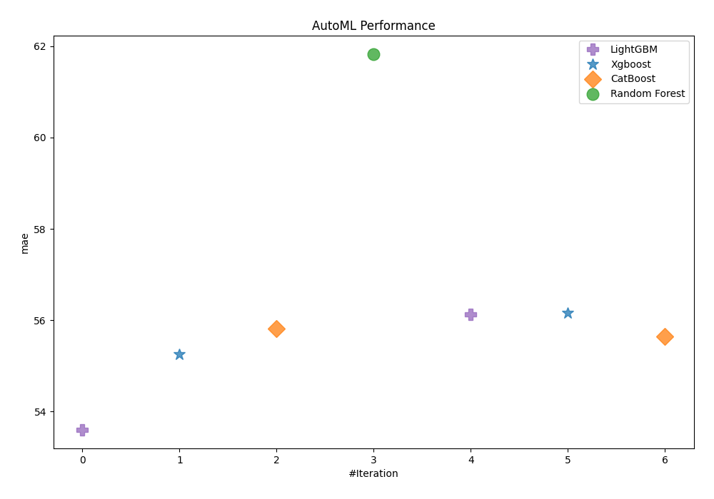
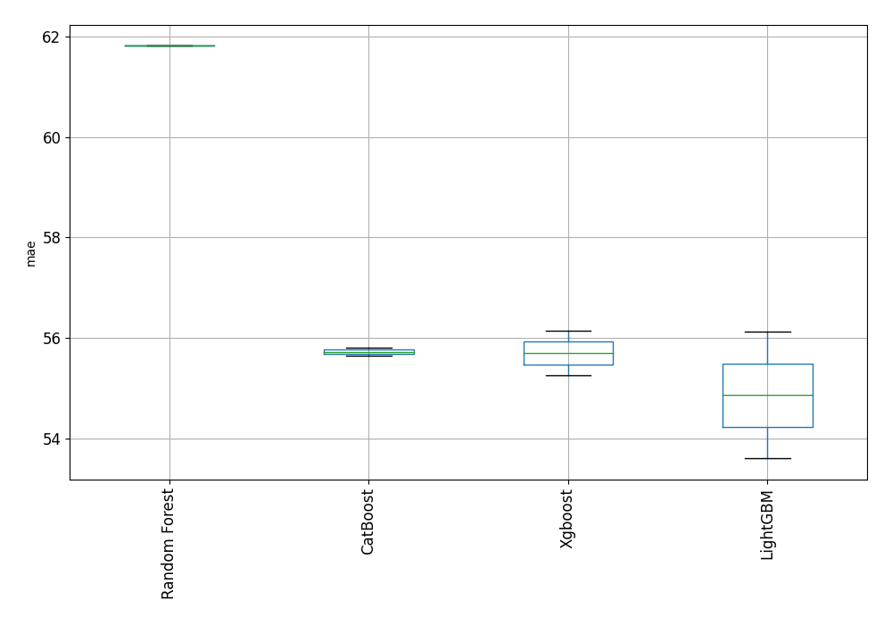

# AutoML Leaderboard

| Best model   | name                                                       | model_type    | metric_type   |   metric_value |   train_time |
|:-------------|:-----------------------------------------------------------|:--------------|:--------------|---------------:|-------------:|
| **the best** | [1_Default_LightGBM](1_Default_LightGBM/README.md)         | LightGBM      | mae           |        53.6022 |        88.17 |
|              | [2_Default_Xgboost](2_Default_Xgboost/README.md)           | Xgboost       | mae           |        55.2534 |        79.61 |
|              | [3_Default_CatBoost](3_Default_CatBoost/README.md)         | CatBoost      | mae           |        55.8096 |       149.03 |
|              | [4_Default_RandomForest](4_Default_RandomForest/README.md) | Random Forest | mae           |        61.8204 |       147.76 |
|              | [14_LightGBM](14_LightGBM/README.md)                       | LightGBM      | mae           |        56.1259 |        32.57 |
|              | [5_Xgboost](5_Xgboost/README.md)                           | Xgboost       | mae           |        56.1512 |        52.58 |
|              | [23_CatBoost](23_CatBoost/README.md)                       | CatBoost      | mae           |        55.6408 |       149.13 |

### AutoML Performance

### AutoML Performance Boxplot
